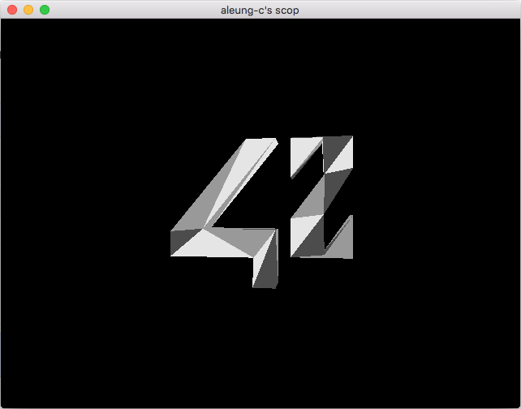
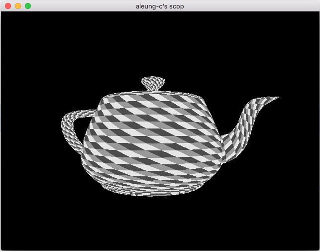
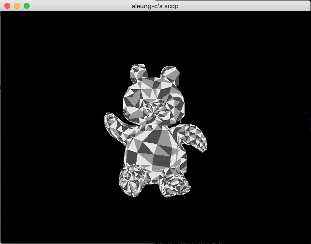

# scop
A C program that displays 3d model in .obj format.

This project is my first step into the world of OpenGL and modern 3d applications.
It is a simple program; it takes a .obj in parameter and parse it, then it displays it on screen
and makes it rotate.

The idea was to discover the way OpenGL works, and more precisely, how modern OpenGL works.
This is why this project is made under OpenGL 4, using shaders to display the models'
vertices and faces.

Then we apply some simple color or texturing, and that gives us a small .obj parser displayer.

